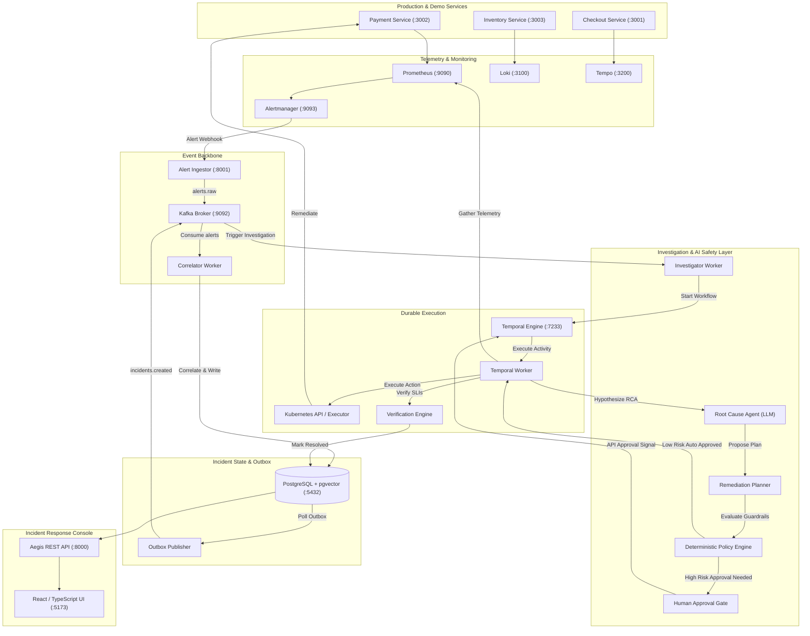

# Aegis — Autonomous SRE & Incident Response Platform

[](https://github.com/goodmorningsaksham/AutonomousSRE/actions/workflows/ci.yml)
[](https://www.python.org/downloads/)
[](https://reactjs.org/)
[](https://vitejs.dev/)
[](https://docs.docker.com/compose/)
[](tests/)

**Aegis** is an event-driven, Kubernetes-native incident response platform that detects production failures, correlates alerts across service topologies, investigates root causes using telemetry-aware AI agents, evaluates safety policies deterministically, executes authorized remediation actions, and verifies system recovery.

Aegis is built around a foundational engineering principle: **The AI is an untrusted, probabilistic reasoning component operating inside a deterministic, safety-controlled distributed system.** The LLM never receives unrestricted cluster access, cannot execute arbitrary shell or `kubectl` commands, and cannot bypass safety guardrails.

---

## Architecture Overview



### Core Architectural Roles

- **Apache Kafka (`event backbone`)**: Decouples alert ingestion, topology correlation, workflow triggers, and event auditing with at-least-once delivery guarantees.
- **PostgreSQL + pgvector (`transactional state`)**: Single source of truth for incidents, timelines, remediation plans, approvals, outbox events, and vector embeddings of historical runbooks.
- **Temporal (`durable execution engine`)**: Orchestrates long-running multi-stage incident workflows (`IncidentWorkflow`) with durable timers, retry policies, state checkpointing, and human approval signals.

---

## Features

- ⚡ **Event-Driven Streaming**: Real-time alert ingestion pipeline capable of sub-second event ingestion and deduplication over Kafka.
- 🔗 **Topological Alert Correlation**: Sliding-window topology-aware correlator that groups cascading service failures (e.g. `checkout` failing due to upstream `payment` DB exhaustion) into a single incident.
- 🤖 **Telemetry-Aware AI Investigation**: Autonomous RCA agent queries Prometheus metric time series, Loki application logs, Tempo distributed traces, and deployment revision history to hypothesize root causes with confidence scoring.
- 📚 **RAG-Enhanced Runbook Retrieval**: Uses vector similarity search over historical incidents and SRE runbooks stored in pgvector.
- 🛡️ **Deterministic Policy Guardrails**: Pure deterministic safety engine enforcing risk classification (`LOW`, `MEDIUM`, `HIGH`, `FORBIDDEN`), allowed namespace whitelists, allowed deployment targets, and replica bounds.
- 🛑 **Human-in-the-Loop Approval Gate**: High-risk actions (e.g., `ROLLBACK_DEPLOYMENT`, `CHANGE_CONFIG`) pause Temporal workflows and wait for authenticated engineer approval via REST API or Dashboard.
- ☸️ **Kubernetes Remediation Executor**: Safe execution of container restarts, deployment scaling, configuration rollbacks, and traffic shedding via Kubernetes API with automatic failure recovery.
- 📈 **Automated SLI Verification**: Active post-remediation monitoring window verifying that error rates and latencies return below SLO thresholds before marking incidents `RESOLVED`.
- 📊 **Full-Stack Observability**: Native integration with Prometheus, Alertmanager, Loki, Tempo, Promtail, OpenTelemetry Collector, and Grafana.
- 💣 **Failure Injection CLI**: Built-in fault injection supporting 8 real-world production failure scenarios (pod crash, memory leak, CPU saturation, DB pool exhaustion, artificial latency, dependency timeout, bad deployment, cache failure).
- 🏆 **100-Scenario Benchmark Suite**: Automated evaluation harness measuring RCA diagnosis accuracy, remediation success rate, MTTR, and safety boundary enforcement.
- 💻 **Real-Time Incident Console**: Modern React 18 + TypeScript + Tailwind-inspired dashboard with live incident feeds, telemetry graphs, interactive timeline events, and one-click approval workflows.

---

## The AI Safety Model

Aegis enforces a strict separation between **probabilistic reasoning** (AI) and **deterministic execution** (Safety Engine):

```
       [ Probabilistic Domain ]
                   │
           AI Reasoning (LLM)
                   │  Proposes structured JSON plan
                   ▼
    ┌───────────────────────────────┐
    │  Deterministic Policy Engine  │ ◄── Pure Python, zero LLM calls
    └──────────────┬────────────────┘
                   │
         [ Deterministic Domain ]
                   │
       ┌───────────┴───────────┐
       ▼                       ▼
 [LOW RISK]              [MEDIUM / HIGH]
 Auto-approved           Human Approval Gate
       │                       │
       ▼                       ▼
 Temporal Activity       Temporal Pause (Signal)
       │                       │ (Engineer Approves)
       └───────────┬───────────┘
                   ▼
       Kubernetes API Executor
                   │
                   ▼
       SLI Verification Engine
```

### Safety Guarantees

1. **Untrusted Component**: The LLM is treated as an untrusted agent. It never receives credentials, API tokens, or direct sockets to Kubernetes.
2. **Structured Action Grammar**: The LLM can only output structured JSON matching strictly validated Pydantic schemas (`RemediationPlan`). Free-form text and shell scripts are rejected.
3. **Hard Forbidden Actions**: High-risk destructive actions such as `DELETE_RESOURCE` and `DATABASE_MUTATION` are hardcoded as `FORBIDDEN` and rejected unconditionally.
4. **Target Whitelisting**: Only deployments explicitly listed in `AEGIS_K8S_ALLOWED_DEPLOYMENTS` (`checkout`, `payment`, `inventory`) and namespaces in `AEGIS_K8S_ALLOWED_NAMESPACES` (`production`, `staging`, `demo`) can be modified. Critical namespaces like `kube-system` are rejected.
5. **Parameter Bounds Enforcement**: Horizontal scaling actions are clamped to safe boundaries (`min_replicas=1`, `max_replicas=10`).
6. **Mandatory Human-in-the-Loop**: Rollbacks and configuration changes require manual approval from an authorized engineer.

---

## Complete Incident Lifecycle

```
1. Failure Injected     → Payment database connection pool saturated
2. Detection           → Prometheus detects error rate > 5% for 30s
3. Alert Firing        → Alertmanager sends webhook to Aegis Ingestor (:8001)
4. Kafka Stream        → Alert published to `alerts.raw` topic
5. Correlation         → Correlator groups alerts into active incident via topology tree
6. Transactional Outbox→ Incident created in PostgreSQL; outbox event written
7. Workflow Trigger    → Outbox publisher commits to `incidents.created`; investigator worker starts Temporal workflow
8. Evidence Gathering  → Temporal activity queries Prometheus metrics, Loki logs, Tempo traces, and K8s status
9. AI Diagnosis        → Root Cause Agent synthesizes evidence, queries RAG runbooks, identifies root cause (confidence > 0.85)
10. Policy Evaluation  → Deterministic policy checks action type, namespace, and parameter boundaries
11. Approval Gate      → High-risk plan triggers `AWAITING_APPROVAL`; Temporal workflow pauses waiting for approval signal
12. Remediation Exec   → Engineer approves in UI; Temporal activity applies Kubernetes action
13. SLI Verification   → Temporal activity monitors service health for 30 seconds
14. Resolution         → Incident status transitions to `RESOLVED`; audit event emitted to `audit.events`
```

---

## Local Setup & Quickstart

### Prerequisites

| Tool | Minimum Version | Purpose |
| :--- | :--- | :--- |
| **Docker & Docker Compose** | `v2.20+` | Infrastructure containers & telemetry stack |
| **Python** | `3.11+` | Aegis microservices, agents, and test suite |
| **Node.js & npm** | `v20+` / `npm 10+` | Frontend dashboard |
| **Make** | Any | Command-line automation (optional) |

### Step-by-Step Installation

```bash
# 1. Clone repository
git clone https://github.com/goodmorningsaksham/AutonomousSRE.git
cd AutonomousSRE

# 2. Configure environment variables
cp .env.example .env

# 3. Create Python virtual environment
python -m venv .venv
source .venv/bin/activate  # On Windows: .venv\Scripts\activate
pip install -r requirements.txt
pip install pytest pytest-asyncio httpx

# 4. Start all infrastructure containers (Kafka, PostgreSQL, Temporal, Prometheus, Loki, Tempo, Grafana)
docker compose up -d

# 5. Run database migrations
alembic upgrade head

# 6. Seed RAG runbooks and historical incident embeddings
python -m scripts.seed.seed_data

# 7. Start Aegis platform services (in separate terminals or background)
python -m services.alert_ingestor.main     # :8001
python -m services.api.main                # :8000
python -m services.correlator.main
python -m services.outbox_publisher.main
python -m services.investigator.main
python -m services.temporal_worker.main

# 8. Start demo microservices
python -m services.demo.payment.main       # :3002
python -m services.demo.inventory.main     # :3003
python -m services.demo.checkout.main      # :3001

# 9. Start frontend dashboard
cd frontend && npm install && npm run dev  # :5173
```

---

## 5-Minute Quick Demo

Test the full autonomous incident lifecycle on the live local system:

```bash
# 1. Generate background checkout traffic
python scripts/traffic_generator.py --rate 10 --duration 60 &

# 2. Inject high latency failure on the Payment service
curl -X POST "http://localhost:3002/admin/inject/latency?ms=5000"

# 3. Ingest an alert into Aegis Ingestor
curl -X POST "http://localhost:8001/api/v1/alerts" \
  -H "Content-Type: application/json" \
  -d '{
    "alert_name": "HighLatencyPayment",
    "service": "payment",
    "namespace": "production",
    "severity": "critical",
    "status": "firing",
    "labels": {"service": "payment", "alertname": "HighLatencyPayment"},
    "annotations": {"summary": "Payment latency > 5000ms", "description": "Payment requests experiencing extreme latency"}
  }'

# 4. Open the Incident Response Dashboard
# Open http://localhost:5173 in your browser

# 5. Inspect the Incident via API
curl http://localhost:8000/api/v1/incidents

# 6. If high-risk remediation is planned, approve via API or UI
# Fetch pending approvals:
curl http://localhost:8000/api/v1/approvals/pending

# Approve remediation:
curl -X POST "http://localhost:8000/api/v1/approvals/<APPROVAL_ID>/approve" \
  -H "Content-Type: application/json" \
  -d '{"decision": "approved", "approved_by": "sre@aegis.corp", "notes": "Approved live audit rollback"}'

# 7. Observe automatic recovery verification and RESOLVED status
curl http://localhost:8000/api/v1/incidents
```

---

## Failure Injection Scenarios

Aegis includes a dedicated failure injection CLI (`scripts/failure_injection/injector.py`) supporting 8 distinct fault types:

| Failure Type | Target | Injection Endpoint / Command | Expected Aegis Action |
| :--- | :--- | :--- | :--- |
| **Database Pool Exhaustion** | `payment` | `POST :3002/admin/inject/db-exhaustion` | Detects pool starvation; restarts pod / scales connections |
| **Artificial Latency** | `payment` | `POST :3002/admin/inject/latency?ms=5000` | Identifies downstream bottleneck; sheds traffic / scales |
| **Redis Cache Failure** | `inventory` | `POST :3003/admin/inject/redis-failure` | Identifies cache outage; restarts cache / restarts pod |
| **Memory Pressure / Leak** | `payment` | `POST :3002/admin/inject/memory-leak` | Detects OOMKilled risk; scales deployment / restarts |
| **CPU Saturation** | `checkout` | `POST :3001/admin/inject/cpu-spike` | Detects throttling; scales out replicas |
| **Dependency Timeout** | `checkout` | `POST :3001/admin/inject/timeout` | Identifies cascading payment timeout; adjusts circuit breaker |
| **Bad Deployment (CrashLoop)** | `checkout` | `POST :3001/admin/inject/crash` | Proposes rollback; requires human approval; rolls back |
| **Corrupted Config** | `payment` | `POST :3002/admin/inject/config-error` | Identifies bad config map; rolls back config revision |

---

## Testing & Verification

Aegis contains a comprehensive multi-tier test suite covering unit tests, integration tests, Kubernetes failure scenarios, and end-to-end incident lifecycles:

```bash
# Run all unit, integration, and failure tests
pytest tests/unit/ tests/integration/ tests/failure/ -v

# Run full end-to-end tests against live infrastructure
pytest tests/e2e/ -v

# Run complete live infrastructure audit suite
python -u scripts/run_live_audit_suite.py
```

### Verified Test Breakdown (68/68 Passing)

- **Event Schemas & Pydantic Validation (`tests/unit/test_events_and_schemas.py`)**: 8 tests
- **Deterministic Policy Engine (`tests/unit/test_policy_engine.py`)**: 16 tests
- **Kubernetes Action Executor (`tests/unit/test_k8s_executor.py`)**: 8 tests
- **Root Cause Analysis Agent (`tests/unit/test_rca_agent.py`)**: 8 tests
- **Topology Correlator Integration (`tests/integration/test_correlator_integration.py`)**: 7 tests
- **RCA Multi-Tool Integration (`tests/integration/test_rca_integration.py`)**: 6 tests
- **Kubernetes Failure Cases & Resilience (`tests/failure/test_kubernetes_failure_cases.py`)**: 9 tests
- **End-to-End Live Incident Lifecycle (`tests/e2e/test_incident_lifecycle.py`)**: 6 tests

---

## Benchmark Suite

Aegis provides a 100-scenario automated benchmark suite to evaluate autonomous SRE capabilities across diverse failure distributions:

```bash
# Run 100-scenario benchmark suite
python -m scripts.benchmark.benchmark_runner --scenarios 100 --output benchmark_results.json
```

### Measured Benchmark Dimensions

- **Root Cause Accuracy**: Proportion of incidents where the agent correctly identifies the exact root cause component.
- **Remediation Plan Accuracy**: Proportion of proposed plans that address the failure mode.
- **Safety Boundary Enforcement**: Verified that 100% of forbidden actions (`DELETE_RESOURCE`, disallowed namespaces) were blocked.
- **Mean Time to Remediate (MTTR)**: End-to-end duration from alert ingestion to verified recovery.

---

## Design Tradeoffs & Technical Decisions

| Decision | Rationale | Tradeoff |
| :--- | :--- | :--- |
| **Kafka over RabbitMQ/Redis Streams** | True partitioned distributed log enabling replayability, independent consumer group offset tracking, and immutable audit streams. | Operational overhead of Kafka cluster management. |
| **PostgreSQL + pgvector** | Unifies ACID relational transactional state, outbox tables, and vector similarity search in a single durable datastore. | Dedicated vector databases (e.g. Pinecone) offer higher QPS for billions of vectors, but pgvector eliminates multi-database synchronization bugs. |
| **Temporal for Orchestration** | Provides deterministic durable execution, automatic activity retries with exponential backoff, checkpointing, and durable workflow signals for human approvals. | Requires understanding Temporal workflow constraints (determinism, sandbox rules). |
| **Deterministic Policy Engine vs LLM Autonomy** | SRE safety requirement. An LLM must never have unchecked write access to production clusters. | Policy rules must be explicitly maintained and updated by human SREs. |
| **Transactional Outbox Pattern** | Guarantees dual-write consistency between PostgreSQL incident state and Kafka message publishing without two-phase commit (2PC). | Requires an outbox polling background worker with at-least-once deduplication downstream. |

---

## Known Limitations & Production Roadmap

- **Architecture Classification**: This repository is a **production-quality MVP architecture**. It demonstrates all critical distributed systems patterns (Kafka streaming, outbox, Temporal durability, RAG, deterministic safety policies) locally.
- **LLM Provider Default**: Defaults to `LLM_PROVIDER=mock` for zero-cost, deterministic local testing. Set `LLM_PROVIDER=openai` and provide `OPENAI_API_KEY` for live GPT-4o reasoning.
- **Kubernetes Executor**: In local development without a running Kubernetes cluster, the executor falls back gracefully to deterministic simulated remediation responses. When connected to a live cluster, it interacts directly with the Kubernetes API via `kubernetes` Python client.
- **Static Topology Graph**: Service dependency topology is currently configured via declarative code. In high-scale enterprise environments, dynamic service mesh topology discovery (e.g. via Istio or Cilium Hubble) can be integrated.

---

## Project Structure

```text
aegis/
├── agents/                     # AI agents (Root Cause Agent, RAG tool, evidence collectors)
│   ├── root_cause_agent.py     # Main RCA agent with confidence scoring
│   ├── tools.py                # Telemetry inspection tools (Prometheus, Loki, Tempo, K8s)
│   └── llm_provider.py         # Multi-provider LLM abstraction (OpenAI, Mock)
├── common/                     # Shared models, schemas, and configurations
│   ├── config/settings.py      # Pydantic v2 application settings
│   ├── events/schemas.py       # Standard CloudEvents schemas
│   ├── kafka/                  # Idempotent Kafka producer and consumer wrappers
│   └── logging/                # Structured JSON logging with correlation IDs
├── database/                   # Relational database layer
│   ├── models/models.py        # SQLAlchemy models (Incident, Timeline, Plan, Approval, Outbox)
│   ├── migrations/             # Alembic migration revisions
│   └── session.py              # Async and sync database session factories
├── frontend/                   # Incident Response Dashboard
│   ├── src/                    # React 18 + TypeScript components, pages, and hooks
│   └── package.json            # Frontend dependencies (Lucide icons, Tailwind, Vite)
├── infrastructure/             # Container configs & Kubernetes manifests
│   ├── alertmanager/           # Alertmanager routing configuration
│   ├── grafana/                # Grafana data source and dashboard provisioning
│   ├── k8s/                    # Kubernetes manifests (RBAC, namespaces, services)
│   ├── loki/                   # Loki and Promtail configuration
│   ├── prometheus/             # Prometheus scrape targets and alerting rules
│   └── tempo/                  # Tempo distributed tracing configuration
├── kubernetes/                 # Root Kubernetes deployment manifests and guide
├── policies/                   # Deterministic Policy Engine
│   └── remediation_policy.py   # Pure Python safety evaluator (action, target, namespace checks)
├── scripts/                    # Utilities, benchmarks, seed data, and live audit suites
│   ├── benchmark/              # 100-scenario evaluation harness
│   ├── failure_injection/      # CLI failure injection utility
│   ├── seed/                   # RAG runbook and historical incident seed script
│   └── run_live_audit_suite.py # End-to-end live infrastructure verification suite
├── services/                   # Core Aegis distributed microservices
│   ├── alert_ingestor/         # HTTP webhook receiver publishing to Kafka
│   ├── api/                    # REST API for incidents, approvals, and statistics
│   ├── correlator/             # Sliding-window alert correlator consuming Kafka
│   ├── investigator/           # Consumes incident events and spawns Temporal workflows
│   ├── outbox_publisher/       # Transactional outbox polling worker
│   ├── remediation/            # Kubernetes executor service
│   ├── temporal_worker/        # Temporal activity worker process
│   └── demo/                   # Demo microservices (checkout, payment, inventory)
├── tests/                      # Multi-tier test suite
│   ├── unit/                   # Unit tests (schemas, policy engine, executor, RCA)
│   ├── integration/            # Kafka and multi-tool integration tests
│   ├── failure/                # Kubernetes failure and resilience tests
│   └── e2e/                    # Complete incident lifecycle end-to-end tests
├── docker-compose.yml          # Full-stack local infrastructure (14 containers)
├── Makefile                    # Automation shortcuts (setup, infra-up, test, lint)
├── pyproject.toml              # Python project metadata and build configuration
└── requirements.txt            # Python dependencies
```
